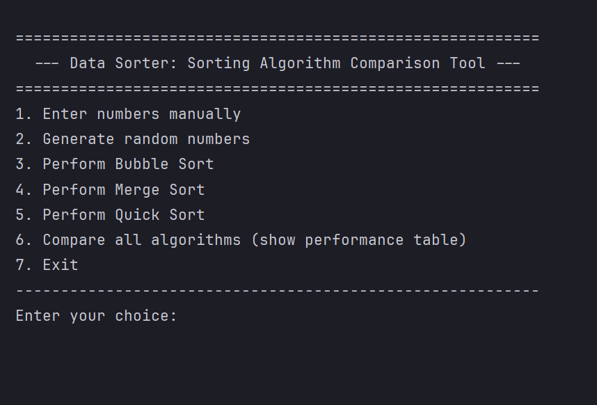

# Data Sorter: Sorting Algorithm Comparison Tool

- **Assessment:** Practical Assignment 02
- **Module:** CIT300 - Data Structures and Algorithms
- **Degree program:** Bachelor of Applied Information Technology (BAIT)
- **Faculty:** Faculty of Computing and IT
- **University:** Sri Lanka Technology Campus (SLTC)

### CIT300 - Practical Assignment 02

This is a console-based Java application developed for the ***CIT300 - Data Structures and Algorithms*** module. The primary goal is to implement and compare the performance of three fundamental sorting algorithms. It measures and displays execution time and the number of operations (steps) for each algorithm, allowing for a clear performance comparison.

---

## 👥 Group Details

* **Member 1:** 22UG3-0108 - Ruchira Vishvajith Dharma Shri
* **Member 2:** 22UG3-0912 - Pandigamage Saleela Kaushal
* **Member 3:** 22UG3-0570 - Thavalampitiye Dhammika
* **Member 4:** 22UG3-0235 - Mihir Chakma

---

## 📋 Features

* **Manual Data Entry:** Allows users to input a custom list of numbers.
* **Random Data Generation:** Can automatically generate a random dataset.
* **Algorithm Implementation:** Includes ``Bubble Sort``, ``Merge Sort``, and ``Quick Sort``.
* **Performance Metrics:** Measures and displays both execution time and the total number of "steps" (comparisons) for each sort.
* **Comparison Table:** Provides a summarized table comparing the time and step counts for all implemented algorithms.
* **Menu-Driven Interface:** A simple and user-friendly console menu for easy navigation.

---

## 🛠️ Algorithms Implemented

* **Bubble Sort** [Cite: *Bubble Sort*](https://github.com/mihirchakma/DataSorterProject/blob/main/DataSorterProject/src/com/datasorter/algorithms/BubbleSort.java)
* **Merge Sort** [Cite: *Merge Sort*](https://github.com/mihirchakma/DataSorterProject/blob/main/DataSorterProject/src/com/datasorter/algorithms/MergeSort.java)
* **Quick Sort** [Cite: *Quick Sort*](https://github.com/mihirchakma/DataSorterProject/blob/main/DataSorterProject/src/com/datasorter/algorithms/QuickSort.java)

---

## 🧑‍💻 Team & Contributions

This project was developed by a team of four members, with roles distributed as follows:

| Member       | Task                                                                                    |
|--------------|-----------------------------------------------------------------------------------------|
| **Member 1** - 22UG3-0108   | Implemented **Bubble Sort** with step count tracking.                    |
| **Member 2** - 22UG3-0912   | Implemented **Merge Sort** and integrated performance measurement.       |
| **Member 3** - 22UG3-0570   | Implemented **Quick Sort** and integrated performance measurement.       |
| **Member 4** - 22UG3-0235   | Developed **data generation, performance comparison table, and UI**.     |

---

## 📂 Project Directory Structure

The project is organized into logical packages to separate concerns:

```
src/
└── com/
    └── datasorter/
        |
        |-- Main.java           (Main Entry point)
        |
        |-- algorithms/         (Member 1, 2, 3's code)
        |   |-- BubbleSort.java
        |   |-- MergeSort.java
        |   `-- QuickSort.java
        |
        |-- model/              (Helper classes for data)
        |   |-- SortPerformance.java
        |   `-- SortResult.java
        |
        |-- service/            (Business logic)
        |   |-- DataHandler.java
        |   `-- PerformanceTester.java
        |
        `-- ui/                 (User interface)
            `-- ConsoleUI.java
```

---

## 🖥️ User Interface



---

## 🧑‍💻 Development (Core Tools)

### Java Development Kit (JDK): 🛠️ ⚙️ 🔧 🧱
  - **Recommendation:** A recent, stable version like *JDK 17 (LTS)* or *JDK 21 (LTS)* or *JDK 25 (LTS)* is recommended.

### Integrated Development Environment (IDE): 💻 ⌨️ 📦
  - **Recommended Options:**
    - **IntelliJ IDEA (Community Edition)** [IntelliJ IDEA](https://www.jetbrains.com/idea/)
    - **Visual Studio Code:** A lightweight and popular choice. You'll need to install the "Extension Pack for Java" from its marketplace.

---

## 🚀 How to Run

1.  **Clone the Repository:**
    ```bash
    git clone <project-repository-url.git>
    
    cd <repository-folder>
    ```

2.  **Compile the Project:**
    (This creates a new `out` directory for the compiled `.class` files)
    ```bash
    mkdir out
    
    javac -d out -sourcepath src src/com/datasorter/Main.java
    ```

3.  **Run the Application:**
    (This runs the `Main` class from the `out` directory)
    ```bash
    java -cp out cit300.datasorter.Main
    ```

**OR**

1. Clone the repository.
2. Run the project in the most common Java IDEs.
3. The process is very similar for all of them: you just need to open the main project folder and then find and run the ***Main.java*** file.
